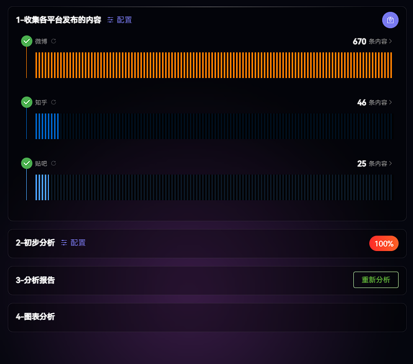
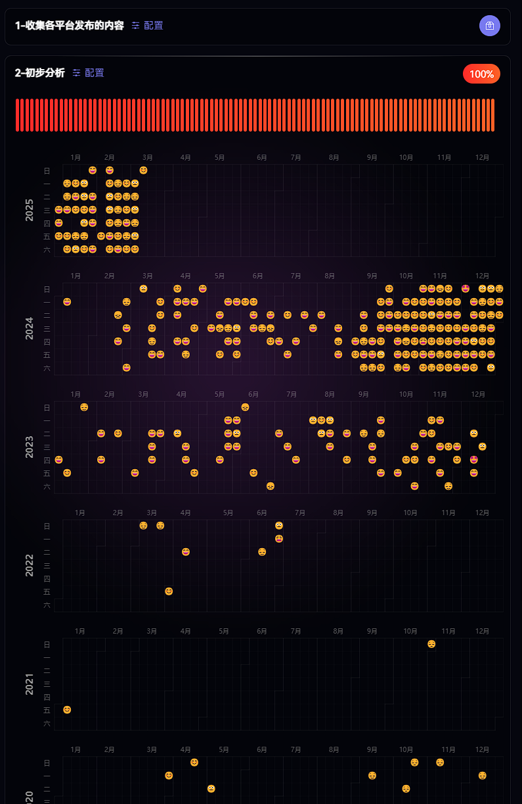

# DataTrace - 数迹

基于 Python3+vue3 构建数据采集与分析，实现个人社交平台数据抓取、交互式可视化及 DeepSeek 增强分析的工具。

#### ✨ 核心功能

##### 🕸️ 多源数据整合

- 支持知乎/微博/贴吧等平台数据采集

##### 🧠 智能分析引擎

- 情绪轨迹可视化（情感倾向）
- 关键字词云
- 发布数量统计
- 内容主题分布
- DeepSeek 增强分析（时间轴概览,深度需求洞察,主题分类,平台分布,关键里程碑,时空轨迹,情绪波动,隐性情绪,用户画像,潜在发展预测,异常数据点解读）

##### 预览





#### 🚀 快速开始

##### 环境要求

- Python 3.9+
- Nodejs 18+

##### 构建

```bash
# 安装python依赖
./ pip install -r requirements.txt

# 安装前端依赖
./frontend npm install

# 开发
./ npm run dev

# 打包
./ npm run build
```
